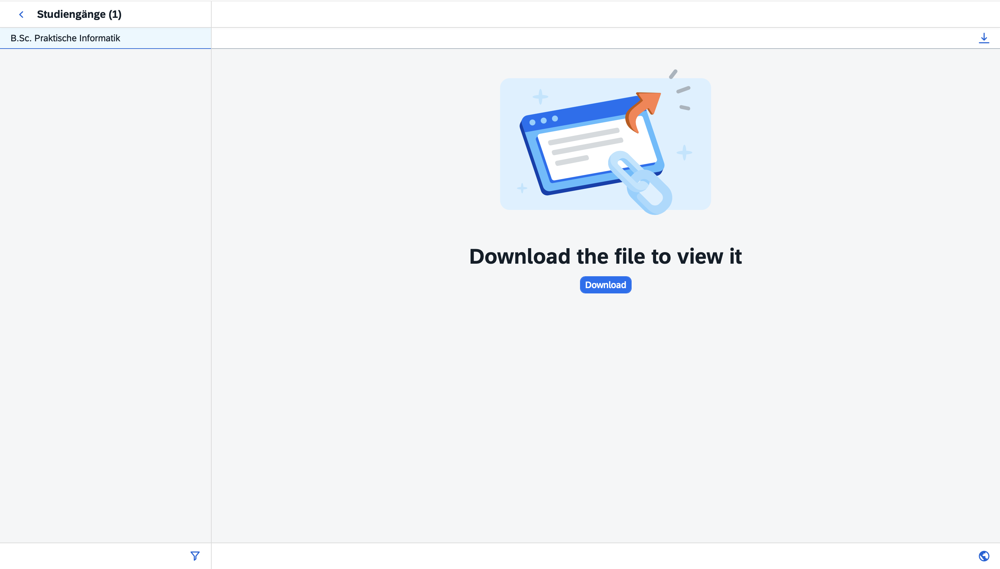

# HTW Saar Grade Tracker

Dieses Python-Script überprüft automatisch die **Leistungsübersicht im HTW SIM-Portal** und sendet eine **Telegram-Nachricht**, sobald eine neue Note eingetragen wurde.

Das Script ist dafür gedacht, regelmäßig (z.B. per Cronjob) ausgeführt zu werden.

---

# Features

- automatischer Login ins HTW SIM Portal
- Download der Leistungsübersicht als PDF
- Extraktion der Noten aus dem PDF
- Vergleich mit vorherigem Stand
- Telegram Benachrichtigung bei neuen Noten
- Headless Browser (läuft ohne sichtbares Fenster)
- Cronjob kompatibel

---

# Projektstruktur

```
noten_scraper/
│
├── script.py
├── setup.sh
├── README.md
├── requirements.txt
├── .env.example
└── tmp/
    ├── grades.pdf
    └── grades.json
```

---

# Voraussetzungen

- Python **3.10+**
- Google Chrome

---

# Installation

Repository klonen:

```bash
git clone https://github.com/lucabritten/HTW_SIM_Grade_tracker.git
cd noten_scraper
```

Setup‑Script ausführen:

```bash
chmod +x setup.sh
./setup.sh
```

**Wichtig:** Stelle sicher, dass Google Chrome installiert ist, da das Script Selenium verwendet.

Das Setup‑Script übernimmt automatisch:

- Erstellung der virtuellen Python‑Umgebung
- Installation aller Abhängigkeiten
- Erstellung des `tmp` Ordners
- Erstellung der `.env` Datei aus `.env.example`
- optionales Einrichten eines Cronjobs (alle 3 Stunden)

Danach muss nur noch die `.env` Datei mit den eigenen Zugangsdaten ausgefüllt werden.

# Environment Variablen

Erstelle eine `.env` Datei im Projektordner.

Beispiel:

```
UNI_USER=dein_hiz_username
UNI_PASSWD=dein_hiz_passwort
TELEGRAM_TOKEN=telegram_bot_token
TELEGRAM_CHAT_ID=deine_chat_id
SAP_OVERVIEW_URL=URL_zu_deiner_Übersicht
```

---

# SAP-Overview URL herausfinden

1. Öffne das SIM-Portal
2. Klicke auf 'Meine Dokumente'
3. Klicke auf Leistungsübersicht
4. Wähle deinen Studiengang aus

Nun solltest du folgenden Screen sehen:

<p align="center">
  
</p>

5. Kopiere die URL dieser Seite und füge sie in deine `.env` Datei unter `SAP_OVERVIEW_URL` ein

---

# Telegram Bot erstellen

1. Öffne Telegram
2. Suche nach **@BotFather**
3. Erstelle einen neuen Bot

```
/newbot
```

Du bekommst anschließend einen **Bot Token**.

---

# Chat ID herausfinden

Sende deinem Bot eine Nachricht und öffne:

```
https://api.telegram.org/bot<TOKEN>/getUpdates
```

In der Antwort findest du deine **chat_id**.

---

# Script ausführen

Manuell:

```bash
python script.py
```

Beim Start sendet das Script eine **"Started" Nachricht** an Telegram.

---

# Automatische Ausführung (Cronjob)

Während des Setups kann optional automatisch ein Cronjob eingerichtet werden.

Dieser führt das Script standardmäßig **alle 3 Stunden** aus.

Falls kein Cronjob eingerichtet wurde, kann er manuell hinzugefügt werden:

```bash
crontab -e
```

Beispiel:

```
0 */3 * * * cd /Users/USERNAME/noten_scraper && ./venv/bin/python script.py
```

---

# Funktionsweise

1. Login in das HTW SIM Portal mit Selenium
2. Navigation zur Leistungsübersicht
3. Download der PDF
4. Extraktion der Noten mit `pdfplumber`
5. Vergleich mit vorherigem Stand (`grades.json`)
6. Telegram Nachricht bei neuen Noten

---

# Beispiel Telegram Nachricht

```
New grade added!
Algorithmen und Datenstrukturen: 1,7
```

---

# Sicherheit

- Zugangsdaten werden nur lokal in `.env` gespeichert
- keine Daten werden extern gespeichert
- keine Speicherung von Passwörtern im Code

---

# Hinweise

Das Script funktioniert nur solange:

- das Layout der Leistungsübersicht gleich bleibt
- das HTW SIM Portal nicht verändert wird
- ChromeDriver wird automatisch über `webdriver-manager` installiert, es ist keine manuelle Installation nötig.

---

# Haftung

Dieses Projekt ist ein **privates Studentenprojekt** und steht in keiner Verbindung zur HTW Saar.

Verwendung auf eigene Verantwortung.
